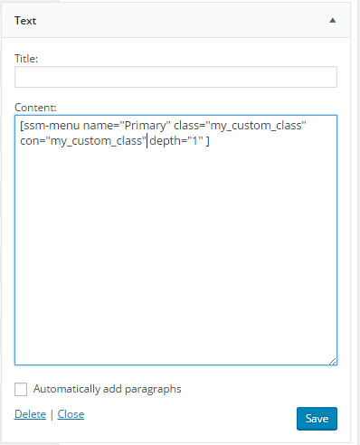

 
# Sailen Short Menu  #
**Author link:** https://www.shivaacharjee.com

**License:** MIT  

WordPress Plugin: Use Shortcode to display Menu List within content and widget area

<a target='_blank' href='https://wordpress.org/plugins/sailen-short-menu/'>Click here to view this plugin on WordPress.org</a>

**Using Shortcode**

<i>[ssm-menu name="YOUR_MENU_NAME" class="CLASS_FOR_UL_TAG" con="CLASS_FOR_THE_CONTAINER" depth="LEVEL" ]</i>

<ol>
 <li>YOUR_MENU_NAME</> [Name of the Menu created by you][Required]</li>

 <li>CLASS_FOR_UL_TAG [If yu want to provide a different class for the Ul tag. Default is assigned] [Optional]</li>

 <li>CLASS_FOR_THE_CONTAINER [If yu want to provide a different class for the container for Ul tag. Default is assigned] [Optional]</li>

 <li>LEVEL [Numeric value to define the level of hierarchy of the MenuItems. Default is 0] [Optional]</li>
</ol>

<i>The Shortcode can also be included within the widget_text</i>

### Display ###

### Through FTP ###
1. Extract the downloaded file. 
1. Upload into `wp-content/plugins` directory
2. Activate the plugin through the 'Plugins' menu in WordPress

  
 
=======
 

